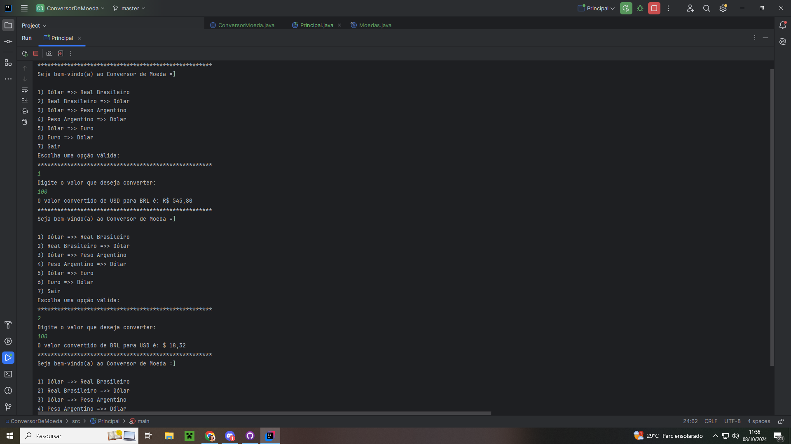

<h1>Projeto Conversor de moedas</h1>

Esse projeto foi feito pela IDE Intellij utilizando a linguagem Java, a proposta do projeto é criar um conversor de moeda, utilizamos o dolar como moeda base para o projeto.

<h2>Utilizações</h2>

Utilizamos a API da Exchange Rate API para realizarmos a conversão.

<h5>Convertemos de:</h5>

Dolar para Real Brasileiro, e o inverso.

Peso Argentino para Dolar, e o inverso.

Euro para dolar, e o inverso.

<h2>Aprendizados</h2>

Com o projeto aprimoramos nossos conhecimentos em:

<h6>Orientações a Objetos;</h6>
<h6>Encapsulamento;</h6>
<h6>Lógica de programação;</h6>
<h6>Reforçamos nosso conhecimento em Loop; </h6>
<h6>Utilização de API: HttpClient, HttpRequest, HttpResponse;</h6>
<h6>Aprendemos a consumir dados não relacionais (Formato JSON) e a converter o formato de Json em Gson.</h6>

<h2>Imagem do projeto no console da IDE Intellij:</h2>

<h5>O projeto foi concluido com os conhecimentos adquirido pelo programa ONE, um programa da Oracle em parceria com a Alura.</h5>
